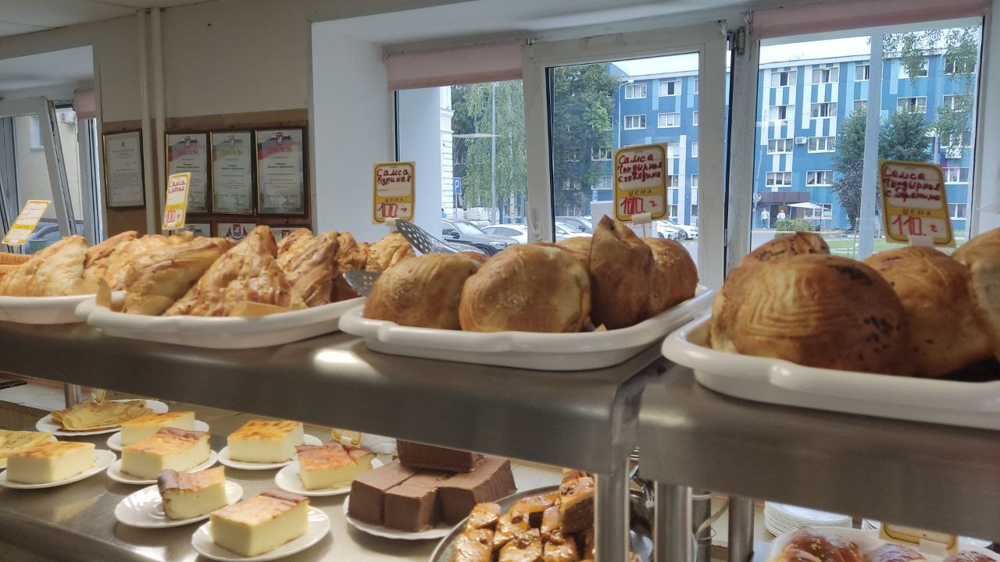

# Буфет в Тройке

Вечный вопрос, где лучше еда на кампусе МФТИ.

В данном гайде будет рассказано про такое непопулярное место как Буфет 3-го общежития(синие здание напротив НК, после турникета направо) или просто "Тройка".

Когда рассказывают про популярные и удобные места, говорят чаще всего о столовой КПМ или КСП. Сравнивать я буду с ними, и мнение субъективно, поэтому предлагаю вам самим сравнить на практике.

Что вообще предлагает Тройка? 

1. Это место по размерам меньше чем КПМ, поэтому это буфет, но при этом ассортимент там не уступает и столовой. Также + к этому что оно непопулярное и там чаще всего спокойно и свободно.
2. Ассортимент. из базовых блюд в виде салатов, компота, сока, супов и различных вторых блюд, которые встречаются во всех столовых МФТИ я выделяю уникальные.
   + Манты, большой и сытный пельмень с мясом. В меню идет как набор из 3х за 220р, но можно попросить поштучно. Не смотря на то, что пельмени не особо вкусные, тут внутри именно рубленый фарш со специями. Со сметаной реально вкусная и сытная вещь
   + Лагман, наваристый, немного томатный, неострый суп. Я считаю его лучшим супом среди остальных из-за его навара(в КСП ощущение что просто воду пьешь иногда), размера овощей - большие кубы картошки и морковки и толстых и сытных макаронин. Сама порция больше по объему чем в остальных столовках. Стоит 90р
   + Недавно появился широкий ассортимент выпечки, а именно - чебуреки, беляши, самса 4х видов(даже тандырная). Стоит 100-110р - нормально
   + Различные необычные сладости: тортики, корзинки с кремом, пахлава, трубочки и т.д. При этом цена нормальная, а не как в КПМ за почку.
3. Часы работы такие же как у других с 7-22.

Важно отметить, что надо правильно выбирать набор из блюд, которые стоит брать в Тройке, иначе набрав всякого можно влететь и на 400р, хотя вкусно поесть можно и за 200р. Вторые блюда сами по себе дорогие, поэтому лучше заранее составить правильные комбинации.

Хорошие варианты:
+ Лагман+Манта(1шт)+Сок -> 196р. Мой любимый набор, которым наедаешься, если не хватает добавляешь что нибудь за 100 и получаешь 290р == обычный обед в КПМ при этом больший по массе
+ Манты(3шт) -> 220р. Со сметаной это очень сытная вещь из-за объема фарша, опять же можно взять доп в виде сока и получить 260р
+ Самса + Лагман + Сок-> 200р. Также очень сытная штука.

